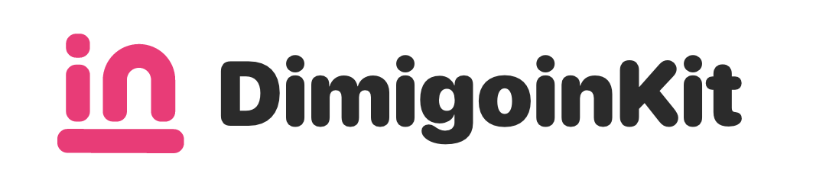

# DimigoinKit

> 디미고인의 iOS/macOS개발을 위한 디미고인 API

## Requirements
* iOS 14+
* Xcode 12
* Swift 5.1+
* SwiftUI
* SwiftUI Property Wrapper에 대한 이해

## Installation
### Swift Package Manager
Swift Package Manager는 Xcode에서 바로 사용할 수 있는 강력한 툴 입니다. 

    File -> Swift Packages -> Add Package Dependancy 

 
    
    https://github.com/changemin/dimigoinkit

## Examples
---

> 준비중

